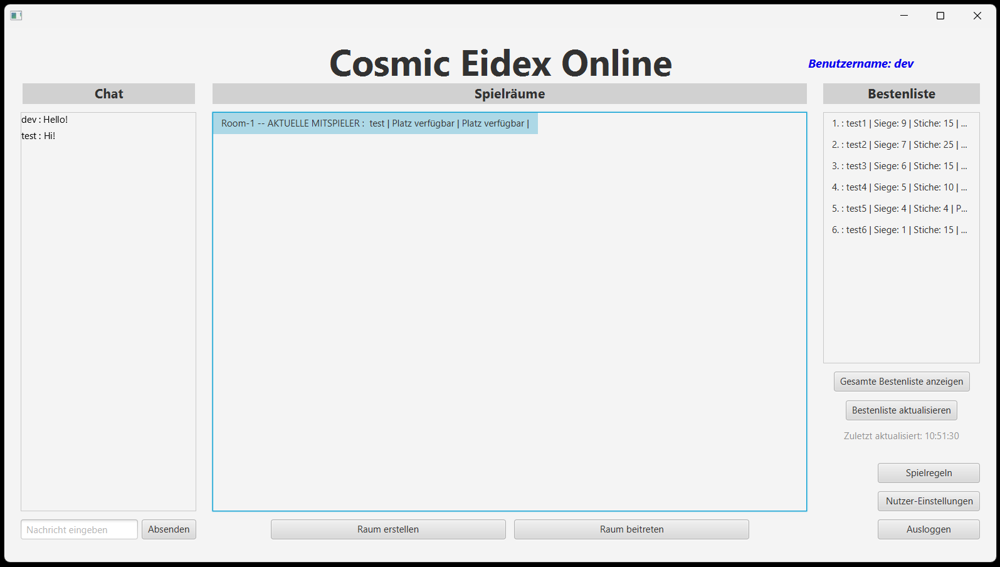
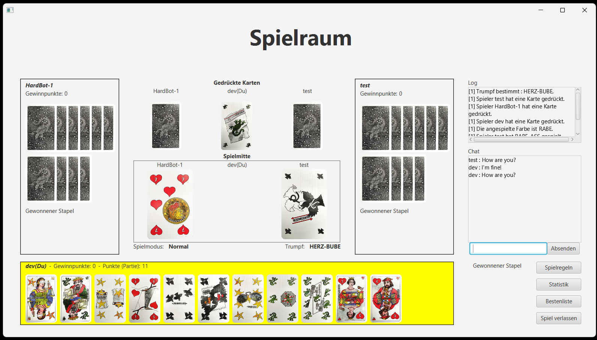
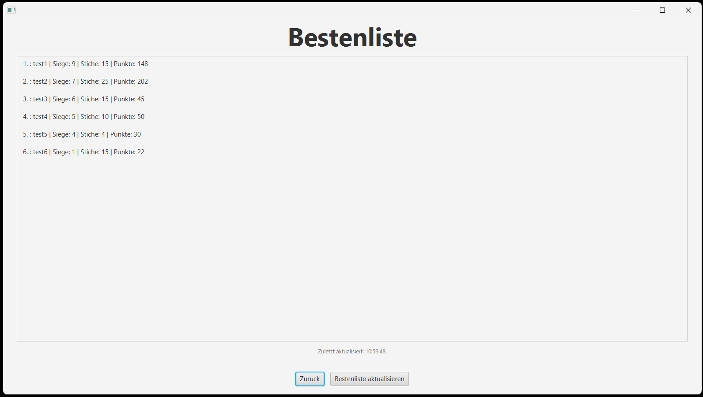

#  Cosmic Eidex
### Multiplayer Client-Server Card Game | Java • JavaFX • Sockets • SQLite

> A real-time multiplayer implementation of the traditional Swiss card game **Eidex**, built with a scalable client-server architecture, JavaFX GUI, bot integration, and persistent user statistics.

---

##  Project Overview

**Cosmic Eidex** is a distributed multiplayer card game designed to demonstrate real-world software engineering principles including:

- Client-server networking (TCP sockets)
- Thread-safe server architecture
- MVC design pattern
- Bot integration
- Persistent database storage
- Clean UI/UX with JavaFX

This project was developed as part of the **Software Engineering Project (SEP)** course at **RPTU Kaiserslautern (Summer Semester 2025)**.

It reflects strong understanding of backend systems, networking, concurrency, UI design, and structured team collaboration.

---

##  Architecture & Design

###  Client-Server Model
- Dedicated server handles:
    - Game sessions
    - Player matchmaking
    - Room lifecycle
    - Bot behavior
    - Score persistence
- Clients communicate using TCP sockets
- Concurrent request handling with thread safety
- Real-time state synchronization across players

###  MVC Pattern
The application follows a clean Model-View-Controller separation:

**Model**
- GameSession
- Player
- Card
- User
- Core rule engine and scoring logic

**View**
- JavaFX (FXML-based UI)
- Login screen
- Lobby & room management
- In-game interface
- Leaderboard

**Controller**
- JavaFX UI controllers
- Server-side networking handlers
- Session coordination logic

---

##  Key Features

###  Multiplayer Gameplay
- Up to 3 players per room
- Real-time trick-taking card game mechanics
- Room creation, join, and leave functionality
- In-game chat support

###  Bot Integration
- EasyBot and HardBot
- Configurable response delay
- Fully integrated into multiplayer sessions
- Automatic turn execution

###  Authentication & Persistence
- User registration and login
- SQLite-backed database
- Persistent leaderboard
- Stored player statistics

###  Game Logic Implementation
- Custom Eidex rules
- Trump handling
- Trick resolution
- Score calculation
- Round and session lifecycle management

###  Robust Backend
- Thread-safe server
- Modular architecture
- Clear separation of networking and logic
- Clean exception handling

---

##  Project Structure

```
src/main/java/com/group06/cosmiceidex/
│
├── client/        → Client networking logic
├── server/        → Server core, sessions, DB management
├── game/          → Game logic, rules, models
├── controllers/   → JavaFX controllers
│
src/main/resources/com/group06/cosmiceidex/
└── FXMLFiles/     → UI layout files
```

---

##  Screenshots

###  Lobby & Room Management


###  In-Game Interface


###  Leaderboard

---

##  Demo Video

A full demo walkthrough is available in the repository.

Path:
```
Product/Product-Demo.mp4
```

The video demonstrates:
- Authentication flow
- Chat
- Room creation
- Multiplayer gameplay
- Bot interaction
- Leaderboard updates

---

##  Technologies Used

- **Java 17+**
- **JavaFX**
- **Maven**
- **SQLite**
- **TCP Sockets**
- **JUnit**

---

##  Running the Project

###  Prerequisites
- Java 17 or higher
- Maven
- SQLite

---

###  Option 1 — Using Prebuilt JAR Files

Prebuilt JAR files are located in:

```
Product/JAR_Files/
```

Follow instructions inside:
```
Product/JAR_Files/Server_JAR/README.txt
Product/JAR_Files/Client_JAR/README.txt
```

Start the server first, then run one or more clients in separate terminals.

---

###  Option 2 — Run from Source

```bash
mvn clean install
mvn javafx:run
```

Run server and client modules separately if required.

---

##  Testing

Unit tests are implemented using JUnit.

Run tests with:

```bash
mvn test
```

---

##  Engineering Highlights

- Real-time multiplayer synchronization
- Concurrency-safe session handling
- Clean modular architecture
- Bot strategy implementation
- Persistent user data storage
- Production-style layered design

This project demonstrates backend architecture skills, networking fundamentals, database integration, and GUI development within a collaborative team environment.

---

##  Contributors

- [Tim Brombacher](https://github.com/Tim-b0)
- [Niklas Brühl](https://github.com/NexoBee)
- [Oliver Thull](https://github.com/unbenutzterName)
- Ruslan Sidukov
- [Devashish Pisal](https://github.com/Devashish-Pisal)

---

##  Academic Context

Developed as part of the Software Engineering Project (SEP) course at RPTU Kaiserslautern, Summer Semester 2025.

---

##  Portfolio Note

This project represents a full-stack desktop application with:

- Distributed system architecture
- Real-time communication
- Database persistence
- Clean UI/UX
- Structured team collaboration

---

> Cosmic Eidex — Bringing a traditional Swiss card game into the digital universe.