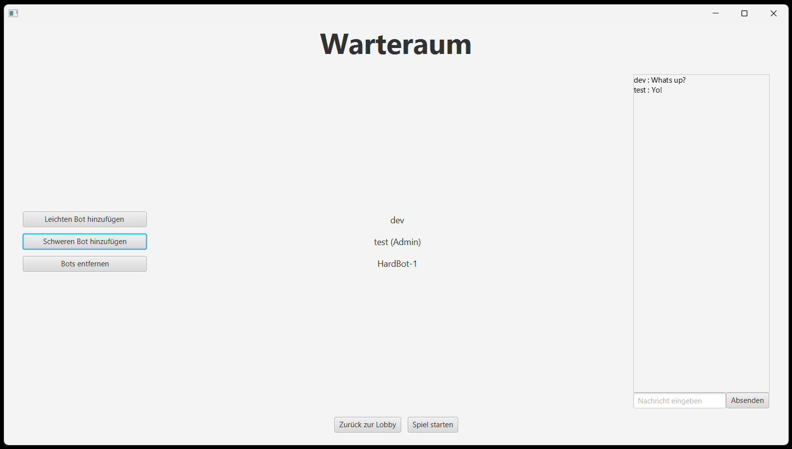
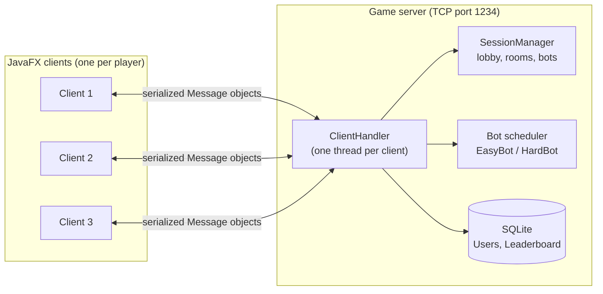

# Cosmic Eidex

**Multiplayer client-server card game | Java 21 · JavaFX · TCP Sockets · SQLite · JUnit 5**

Cosmic Eidex is a networked desktop version of *Eidex*, a traditional Swiss trick-taking card game for three players. Players register, meet in a lobby, open password-protected game rooms, fill empty seats with computer opponents and play complete tournaments over the network. Every finished game updates a persistent leaderboard.

A team of five students built the application in the **Software Development Project (Software-Entwicklungs-Projekt, SEP)** at **RPTU Kaiserslautern-Landau** in the summer semester of 2025. The work followed a formal requirements specification issued by the Human Computer Interaction group (AG Human Computer Interaction).

---

## At a Glance

| | |
|---|---|
| **Project type** | University team project: distributed desktop application |
| **Period** | April to July 2025 (summer semester 2025) |
| **Team size** | 5 developers |
| **My role** | Server and networking layer, core game engine, game-room UI (see [My Contributions](#my-contributions)) |
| **Tech stack** | Java 21, JavaFX 23 / FXML, TCP sockets, SQLite / JDBC, Maven, JUnit 5, Mockito, JaCoCo |
| **Code size** | About 8,700 lines of production code and 5,500 lines of test code |
| **Testing** | 330+ automated unit tests and 70 documented system test scenarios (all passed) |
| **Working language** | German (requirements specification, user interface, Javadoc) |
| **Deliverables** | Prebuilt server and client JARs, full Javadoc, system test report, demo video |

---

## Key Skills Demonstrated

| Area | What was implemented |
|---|---|
| **Backend and networking** | TCP server with one thread per client and a custom message protocol of 48 message types, sent as serialized Java objects |
| **Concurrency** | Thread-safe registry of sessions and rooms (`ConcurrentHashMap`), synchronized game engine, `ScheduledExecutorService` for bot turns |
| **Algorithms and game logic** | Rule engine with three game modes, legal-move validation, trick evaluation, multi-stage scoring and an 8-state game state machine |
| **Game AI** | Two computer opponents: a random *EasyBot* and a rule-aware, heuristic *HardBot* |
| **Databases** | SQLite schema with foreign keys and cascading deletes, JDBC with prepared statements, UPSERT queries, automatic database setup on first start |
| **GUI development** | 13 JavaFX screens built with FXML |
| **Software architecture** | MVC, Singleton, interface-based polymorphism (`PlayerInterface`), Java Platform Module System (JPMS), UI logic kept separate from the GUI so it can be unit-tested |
| **Quality assurance** | JUnit 5, Mockito, JaCoCo coverage reports, manual system tests traced to requirements and use cases |
| **Documentation** | Javadoc for the whole codebase, requirements specification, rule documentation |
| **Teamwork** | Five-person team using Git, working from a customer-style requirements specification to a deadline |

---

## My Contributions

*Devashish Pisal*: my main responsibilities within the team were:

- **Server and networking layer** (`Server`, `ClientHandler`, `SessionManager`, `Client`): the multi-threaded TCP server, handling of client connections, lobby and room management, and broadcasting messages to everyone in a room.
- **Communication protocol** (`Message`): designing the request/response protocol between client and server.
- **Core game engine** (`GameSession`): dealing, deciding trump and game mode, validating moves, evaluating tricks, scoring and the game state machine.
- **Game-room UI** (`SpielraumController`, `StatistikController`): the main game table, the largest JavaFX controller in the project, plus the statistics view shown during a game.
- **Persistence**: contributions to the SQLite data access layer (`DatabaseService`).

---

## Features

### Accounts and Lobby
- Registration with unique usernames, login, logout and password change
- Each account can only be logged in once at a time
- Lobby with a live list of open rooms and who is in them, a global chat and a top-10 leaderboard
- Client can connect to any server on the local network through an IP/port configuration screen

### Game Rooms
- Create password-protected rooms, or join one with its name and password
- Waiting room with a participant list, a room admin role for the creator, and a room chat
- The admin can fill the three seats with EasyBots or HardBots, remove bots and start the game
- When a game ends, the room is closed and its players return to the lobby

### Gameplay
- Complete Eidex rule set (see [Game Rules Implemented](#game-rules-implemented))
- Game table showing your hand, opponents' card counts, face-down cards, the current trick, game mode, trump and win points
- Game log listing every action in order, plus an in-game chat
- Personal statistics during the game and a winner board at the end
- Rules screen built into the client

### Leaderboard and Persistence
- Wins, tricks and points for each player are stored in SQLite and updated after every game
- Top-10 view and a full leaderboard, ranked by wins, then tricks, then points

---

## Screenshots

*The user interface is in German, as the project specification required.*

**Lobby**: open rooms, global chat and leaderboard


**Waiting room**: participants, room admin, bot management and room chat


**Game room**: hand, face-down cards, current trick, game mode, trump, game log and chat


**Leaderboard**: full ranking by wins, tricks and points


### Demo Video

A full walkthrough is in [`Product/Product-Demo.mp4`](Product/Product-Demo.mp4). It covers registration and login, chat, creating rooms, a multiplayer game with bots, and leaderboard updates.

---

## Architecture



### Client-Server Communication
- Clients talk to the server over **TCP sockets** using `ObjectInputStream`/`ObjectOutputStream`.
- The server starts a separate `ClientHandler` thread for each connected client. Incoming messages are sorted into four groups: authentication, lobby, room management and game logic.
- `SessionManager` tracks logged-in users, active rooms, room passwords and bots in concurrent collections, and pushes updates (room lists, participant lists, chat) to every client in a room.

### Game State Flow
1. The active player's client applies a move to its copy of the `GameSession`, which checks it against the rules (for example, it rejects under-trumping).
2. The client sends the updated session to the server in an `UPDATE_REQUEST`.
3. The server sends the new state to every player in the room and plays any bot turns with a 3-second delay. When the game is over, it saves wins, tricks and points to the database and closes the room.

### Design Patterns and Structure
- **MVC**: FXML views, JavaFX controllers, and game and domain model classes. UI logic that does not depend on JavaFX lives in a separate `controllerlogic` package, so it can be unit-tested.
- **Singleton**: `Server`, `SessionManager`, `DatabaseService` and `Client` each have a single instance.
- **Polymorphism**: human players, `EasyBot` and `HardBot` all implement `PlayerInterface`, so the game engine treats them the same way.
- **JPMS**: the application is packaged as a Java module (`com.group06.cosmiceidex`).

### Persistence
- **SQLite** through JDBC. The database is created automatically on first start at `~/CosmicEidex/Tables.db`, using a bundled SQL script.
- Schema: `Users` (unique names) and `Leaderboard` (foreign key to `Users` with `ON DELETE CASCADE`).
- All queries use prepared statements. Leaderboard updates use an UPSERT (`INSERT ... ON CONFLICT DO UPDATE`).

---

## Game Rules Implemented

- 36-card Swiss deck in four suits (Herz, Eidex, Rabe, Stern), from Six to Ace
- Three players with 12 cards each. The last card dealt decides the game mode:
  - **Trump game**: that card's suit becomes trump
  - **Obenabe** (an Ace is turned up): no trump, the highest card wins
  - **Undenufe** (a Six is turned up): no trump, the lowest card wins
- Each mode has its own card ranking and point values
- Each player first discards one card face down. It still counts toward that player's points
- Players must follow suit but may play a trump at any time. Under-trumping is not allowed, and the trump Jack follows a special rule
- 5 bonus points for the last trick. Win points are awarded after each hand according to the official rules, including the 100-point limit, taking every trick, and tie-breaks
- The game ends when one player reaches 7 win points

---

## Computer Opponents

| Bot | Strategy |
|---|---|
| **EasyBot** | Discards and leads random cards and follows suit with the first matching card. A beginner-level opponent. |
| **HardBot** | Works out every legal move for the current mode. It tries to win a trick with the cheapest winning card, gives away low-value cards when it cannot win, and adjusts its discard and lead to the mode (trump, Obenabe or Undenufe). |

Bots run on the server and fill any empty seats in a room.

---

## Quality Assurance

- **330+ JUnit 5 unit tests** in 25 test classes covering the server, client, game engine, bots, database layer, UI logic, data models and exceptions
- **Mockito** mocks sockets, object streams, the database service and other server components, so the networking code is tested in isolation
- **JaCoCo** generates coverage reports (GUI controllers are excluded)
- **70 documented system test scenarios** ([`Product/Systemtests.xlsx`](Product/Systemtests.xlsx)), grouped by functional requirement, use case and non-functional requirement, all passed. They include usability checks with test users of different ages
- **Full Javadoc**, generated in [`Product/JavaDoc`](Product/JavaDoc/index.html)

---

## Tech Stack

| Category | Technology |
|---|---|
| Language | Java 21 (Java Platform Module System) |
| GUI | JavaFX 23, FXML |
| Networking | `java.net` TCP sockets, Java object serialization |
| Concurrency | `java.util.concurrent` (`ConcurrentHashMap`, `ScheduledExecutorService`), synchronized methods |
| Database | SQLite, JDBC (`sqlite-jdbc`) |
| Build | Maven, Maven Wrapper, `javafx-maven-plugin` |
| Testing | JUnit 5, Mockito, JaCoCo |
| Documentation | Javadoc |
| Tools | IntelliJ IDEA, Git / GitHub, DBeaver |

---

## Getting Started

### Prerequisites
- **JDK 21 or newer**. The JavaFX 24.0.2 SDK bundled for the prebuilt client needs JDK 22 or newer.
- **Maven 3.8+** to build from source. The project also includes a Maven Wrapper.

### Option 1: Prebuilt JAR Files

**1. Start the server.** It listens on port `1234` and prints its local network IP address:

```bash
java -jar Product/JAR_Files/Server_JAR/Server.jar
```

**2. Start one client per player**, passing the JavaFX SDK for your operating system:

```bash
java --module-path "<path-to-javafx-sdk>/lib" --add-modules javafx.controls,javafx.fxml -jar Product/JAR_Files/Client_JAR/Client.jar
```

- JavaFX SDKs for Windows and macOS (x64) are already unpacked in `Product/JAR_Files/Client_JAR/`. A Linux SDK is available as a ZIP in `javaFX_sdk_zip_files/`. Other platforms can download one from [Gluon](https://gluonhq.com/products/javafx/).
- The client connects to `localhost:1234` by default. To play across a network, enter the server's IP address in the client's IP configuration screen.

See also [`Server_JAR/README.txt`](Product/JAR_Files/Server_JAR/README.txt) and [`Client_JAR/README.txt`](Product/JAR_Files/Client_JAR/README.txt).

### Option 2: Build and Run from Source

```bash
cd "Implementation/Cosmic Eidex"
mvn clean javafx:run          # starts the JavaFX client
```

Start the server by running `com.group06.cosmiceidex.server.Server` from your IDE. The client's main class is `com.group06.cosmiceidex.controllers.GameApplication`.

### Demo Accounts
On first start, the database is seeded with sample accounts `test1` to `test6`. Each password is the same as the username (for example `test1` / `test1`).

### Running Tests and Coverage

```bash
cd "Implementation/Cosmic Eidex"
mvn test                      # run all unit tests
mvn verify                    # run tests and generate the JaCoCo report in target/site/jacoco/
```

---

## Project Structure

```
cosmic-eidex-game/
├── Implementation/Cosmic Eidex/        # Maven project (source code)
│   ├── pom.xml
│   └── src/
│       ├── main/java/com/group06/cosmiceidex/
│       │   ├── server/                 # TCP server, client handlers, session/room management, database service
│       │   ├── client/                 # Client connection and server message handling
│       │   ├── common/                 # Shared protocol and data classes (Message, User, RoomCredential, ...)
│       │   ├── game/                   # Game engine: GameSession, Card, Deck, Player, rules and enums
│       │   ├── bots/                   # EasyBot and HardBot used in live games
│       │   ├── bot/                    # Early bot prototypes and an offline simulation harness
│       │   ├── controllers/            # JavaFX controllers (one per screen)
│       │   ├── controllerlogic/        # UI logic without JavaFX dependencies (unit-testable)
│       │   └── exceptions/             # Custom exceptions
│       ├── main/resources/com/group06/cosmiceidex/
│       │   ├── FXMLFiles/              # 13 FXML screen layouts
│       │   ├── database/               # SQL schema and seed data
│       │   └── images/                 # Card and GUI graphics
│       └── test/java/                  # JUnit 5 test suites
├── Product/
│   ├── JAR_Files/                      # Prebuilt Server.jar, Client.jar and JavaFX SDKs
│   ├── JavaDoc/                        # Generated API documentation
│   ├── Systemtests.xlsx                # System test report
│   └── Product-Demo.mp4                # Demo video
├── Documents/                          # Requirements specification and game rules (DE/EN)
└── assets/                             # README screenshots
```

---

## Documentation

| Document | Description |
|---|---|
| [`Documents/Spezifikation.pdf`](Documents/Spezifikation.pdf) | Requirements specification from the course (German) |
| [`Documents/spielregeln-cosmic-eidex.pdf`](Documents/spielregeln-cosmic-eidex.pdf) | Official game rules (German) |
| [`Documents/cosmic-edex_rules_english.doc`](Documents/cosmic-edex_rules_english.doc) | Game rules (English) |
| [`Product/JavaDoc/index.html`](Product/JavaDoc/index.html) | API documentation |
| [`Product/Systemtests.xlsx`](Product/Systemtests.xlsx) | System test cases and results |

---

## Team

| Name | GitHub |
|---|---|
| Tim Brombacher | [@Tim-b0](https://github.com/Tim-b0) |
| Niklas Brühl | [@NexoBee](https://github.com/NexoBee) |
| Oliver Thull | [@unbenutzterName](https://github.com/unbenutzterName) |
| Ruslan Sidukov | – |
| Devashish Pisal | [@Devashish-Pisal](https://github.com/Devashish-Pisal) |

---

## Academic Context

Built for the **Software Development Project (SEP) 2025** at **RPTU Kaiserslautern-Landau**, supervised by the Human Computer Interaction group (apl. Prof. Dr. Achim Ebert). The course requirements covered a client-server architecture, a JavaFX GUI, two computer opponents of different strength, a persistent leaderboard, JUnit tests for all non-GUI classes, documented system tests and complete Javadoc.
